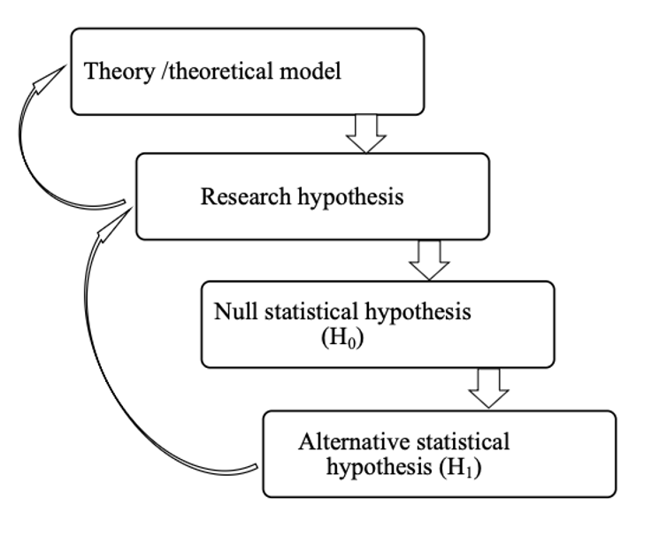
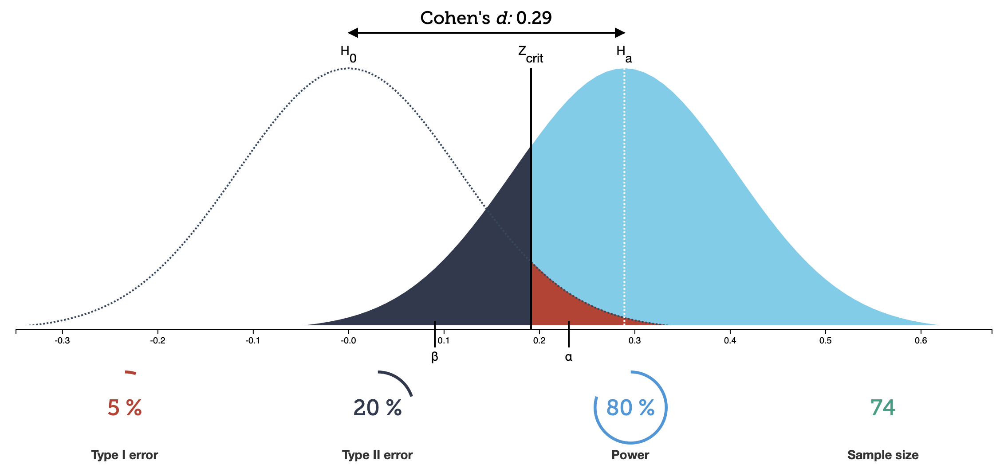
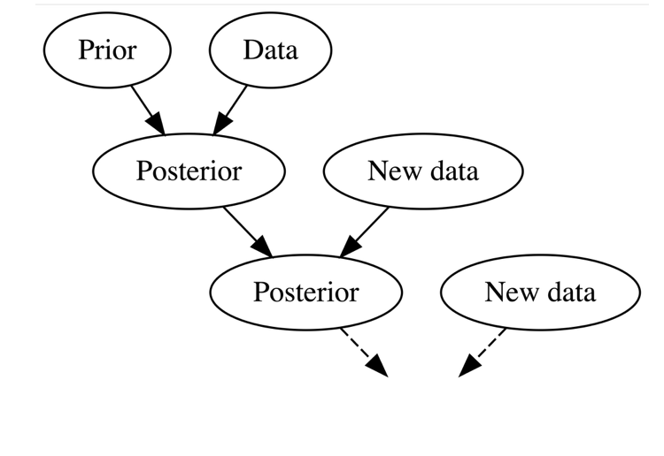

# Two statistical philosophies

- Frequentist or Null hypothesis significance testing (NHST)

- Bayesian (Bayes theorem)

# Frequentist

- Goal: not to make a fool out of yourself too often in the long run (error control)

# Why to control for error rates?

- Any observed effect (difference between treatments, groups, or conditions) is influenced by sampling variation

```{r}
set.seed(123)

library(ggplot2)
library(effectsize)

sim <- function(n){
  group1 <- rnorm(n, 0, 1)
  group2 <- rnorm(n, 0, 1)
  d <- cohens_d(group1, group2)$Cohens_d
}

d_rep <- replicate(100, sim(30))

d_rep |> 
  as.data.frame() |>  
  dplyr::rename(d = 1) |> 
  ggplot(aes(x = d, y = "Cohen's d")) +
  ylab(NULL) +
  geom_vline(xintercept = 0) +
  geom_jitter() +
  ggtitle("Distribution of effect sizes (two-sided t-test, N = 60 and a true effect of 0)")
```

# Why to control for error rates?

- We need a methodological procedure that allows us to make claim while controlling for error rates

- We want to make claims (e.g., this intervention is superior to a control intervention)

# Null hypothesis significance testing (NHST)

```{r fig.align ="center", out.width="80%", fig.show="hold"}

```

# 4 states of the world

|                     | Reject H0               | Do not reject H0        |
|---------------------|-------------------------|-------------------------|
| H0 true (no effect) | Type I error ($\alpha$) | Correct (1 − $\alpha$)  |
| H1 true (effect)    | Correct (1 − $\beta$)   | Type II error ($\beta$) |

$\alpha$ = probability of making a type I error $\beta$ = probability of making a type II error power = 1 - $\beta$

# What will your next study show?

```{r}
#| echo: true 
H0 <- 0.5 # probability of H0 being true 
H1 <- 0.5 # probability of H1 being true 
alpha <- 0.05 # type I error
power <- 0.8  # power (1 - type II error)
```

|                     | Reject H0           | Do not reject H0          |
|---------------------|---------------------|---------------------------|
| H0 true (no effect) | 0.5 \* 0.05 = 0.025 | 0.5 \*( 1 - 0.05) = 0.475 |
| H1 true (effect)    | 0.5 \* 0.8 = 0.4    | (1 - 0.8) \* 0.5 = 0.1    |

# How to improve? Decrease type II error rate (increase power)

```{r}
#| echo: true 
H0 <- 0.5 # probability of H0 being true 
H1 <- 0.5 # probability of H1 being true 
alpha <- 0.05 # type I error
power <- 0.9  # power (1 - type II error)
```

|                     | Reject H0           | Do not reject H0          |
|---------------------|---------------------|---------------------------|
| H0 true (no effect) | 0.5 \* 0.05 = 0.025 | 0.5 \*( 1 - 0.05) = 0.475 |
| H1 true (effect)    | 0.5 \* 0.9 = 0.45   | (1 - 0.9) \* 0.5 = 0.05   |

# How to improve? Decrease type I error rate

```{r}
#| echo: true
H0 <- 0.5 # probability of H0 being true
H1 <- 0.5 # probability of H1 being true
alpha <- 0.01 # type I error
power <-  0.9  # power ( 1 - type II error)
```

|                        | Reject H0           | Do not reject H0          |
|------------------------|---------------------|---------------------------|
| $H_0$ true (no effect) | 0.5 \* 0.01 = 0.005 | 0.5 \*( 1 - 0.01) = 0.495 |
| $H_1$ true (effect)    | 0.5 \* 0.9 = 0.45   | (1 - 0.9) \* 0.5 = 0.05   |

# 

```{r fig.align ="center", out.width="90%", fig.show="hold"}

```

From [Kristoffer Magnusson's blog](https://rpsychologist.com/d3/nhst/). Check it[ ](#0)out to learn more about NHST.

# Which error should the investigator aim for?

- It depends (Is it more serious to convict an innocent man, or to acquit a guilty?)

- What is most costly?

- Determining how the balance must be struck should be left to the investigator

- However, most investigators use an $\alpha$ level of 0.05 and power of 80% by default

# Frequentist testing (example)

- $H$: there is a difference between the two groups (non-directional prediction)

- Set $H_0$: $\mu_A$ - $\mu_B$= 0 (but it could be any number, or a range and it should be the opposite as to your $H$)

- Set $H_1$: $\mu_A$ - $\mu_B$ $\neq$ 0 (non-directional buth it could be directional: $>$ (greater) or $<$ (smaller), depending on your $H$)

- Use a statistical test to calculate a test statistic

- Calculate a *p*-value: the probability of seeing data/test statistics as extreme or more extreme than the observed data with repeated sampling when $H_0$ is true

# *P*-value as a rule to govern our behavior in the long run

- *p* $\leq$ $\alpha$: Reject $H_0$
- *p* $>$ $\alpha$: Fail to reject $H_0$
- When you act as if there is an effect when p $\leq$ 0.05, in the long run you won’t be wrong more than 5% of the time

# Interpretation of a *p*-value

- A *p*-value is the probability of getting the observed or more extreme data, assuming $H_0$ is true. In other words: $P$(data is extreme or more extreme\| $H_0$)

- If you want to know the probability of $H$, we need Bayesian statistics

- Important! When $p$ $>$ $\alpha$, we can't conclude in favour of $H_0$. We are looking for enough evidence to reject $H_0$. If we fail to reject $H_0$, we do not conclude $H_0$ is true. To accept $H_0$, wee need an equivalence test (next lecture)

# Frequentist interpretation of a *p*-value

- Error rates are frequentist concepts. They are about the long run!
- If I were to repeat the same experiment 1000 times, how many replications would yield a significant *p*-value?
- Check [Magnusson's app](https://rpsychologist.com/d3/pdist/) out to see how statistical power affects the distribution of *p*-values

# Distribution of *p*-values when power is 80%

```{r}
#| echo: false
set.seed(123)

n_sim <- 1000
n_per_group <- 50
alpha <- 0.05

simulate_pvals <- function(effect_size) {
  pvals <- numeric(n_sim)
  
  for (i in 1:n_sim) {
    g1 <- rnorm(n_per_group, mean = 0, sd = 1)
    g2 <- rnorm(n_per_group, mean = effect_size, sd = 1)
    
    pvals[i] <- t.test(g1, g2, var.equal = TRUE)$p.value
  }
  
  return(pvals)
}

# Simulations
pvals_power80 <- simulate_pvals(0.55)  # ~80% power
pvals_null <- simulate_pvals(0)        # no effect
pvals_power50 <- simulate_pvals(0.4)  

# Check
power1 <- mean(pvals_power80 < alpha)
power2 <- mean(pvals_power50 < alpha)
power3 <- mean(pvals_null < alpha)

hist(pvals_power80,
     breaks = 20,
     main = NULL,
     xlab = "p-value")

abline(v = alpha, lwd = 2)
```

# Distribution of *p*-values power is 50%

```{r}
hist(pvals_power50,
     breaks = 20,
     main = NULL,
     xlab = "p-value")
```

# Distribution of *p*-values when the null hypothesis is true

```{r}
hist(pvals_null,
     breaks = 20,
     main = NULL,
     xlab = "p-value")

abline(v = alpha, lwd = 2)
```

# 

- Assuming $H_0$ is false, the higher the statistical power, the more left skewed the distribution of *p*-values is

- When $H_0$ is true, the power of the test corresponds to the type I error rate

- That is, 5% of *p*-values will be smaller than the type I error rate ($\alpha$ = 0.05)

# 

“no isolated experiment, however significant in itself, can suffice for the experimental demonstration of any natural phenomenon”

Fisher, 1937, p. 13

# Summary of NHST

- Decide upon type I and type II error rates
- *P*-value is the probability of observing data (or more extreme) assuming $H_0$ is true
- A statistical test is used to compute a *p*-value
- Based on the *p*-value, decide to reject or fail to reject $H_0$
- NHST results in a binary decision (reject/not reject)
- Use NHST if you want to control how often you will be wrong in the long term

# Bayesian analysis

- Bayesian statistics allows you to express evidence in terms of ‘degrees of belief.’

# Interpreting probability

- In the Bayesian philosophy, a probability measures the relative plausibility of an event

- In the frequentist philosophy, a probability is interpreted as the long-run relative frequency of a repeatable event.

# Bayesian workflow

```{r fig.align ="center", out.width="80%", fig.show="hold"}

```

# Bayesian workflow

A *prior* represents the information about an uncertain parameter that is combined with the probability distribution of **new data** to yield the **posterior** distribution

# Bayes Rule

$$\text{P(B|A)} = \frac{\text{P(B)} * \text{L(B|A)}}{\text{P(A)}}$$

$$\text{posterior} = \frac{\text{priori} * \text{likelihood}}{\text{normalizing constant}}$$

# The Prior

- The prior represents our understanding and uncertainty about an unknown parameter

- It is quantified using a prior probability distribution or range of values that the researcher considers credible before collecting data

- It is informed by previous studies or expert opinion: “today’s posterior is tomorrow’s prior” (Dennis Lindley)

- For a continuous outcome, we can model the prior as normal distribution. There are only two parameters to set: mean and standard deviation

# Example of prior

- Suppose we want to know how much milk a cow produces on average per day

- We have 10 cows with an average production of 23L a day and a standard deviation of 4

```{r out.width="70%"}
library(bayesrules)
plot_normal(mean = 23, sd = 4)
```

# Prior, data and posterior

- Now suppose that we collect data from more farms

- We can use the Bayes theorem to estimate the posterior distribution

```{r out.width="70%"}
#| echo: true
m1 <- 24        # prior mean
sd1 <- 5        # prior standard deviation
variance <- 25  # variance
m2 <- 25        # observed mean of produced milk at our farm
sample <- 30    # sample size of cows

plot <- plot_normal_normal(mean = m1, sd = sd1, 
                           sigma = variance,
                           y_bar = m2, n = sample)
```

# Plot the prior, data and posterior

```{r}
plot
```

# Summary statistics

```{r}
summarize_normal_normal(mean = m1, sd = sd1, 
                        sigma = variance,
                        y_bar = m2, 
                        n = sample)
```

# What happens if we increase the sample size of cows?

```{r}
sample <- 100    # sample size of cows

plot_normal_normal(mean = m1, sd = sd1, sigma = variance,
                   y_bar = m2, n = sample)
```

# 

- As we collect more data, the posterior is dominated by data

# Weak prior

- A weak prior is intentionally uninformative
- Still enforces basic constraints (e.g., physical limits)
- Has large variance -\> spreads values over a wide range
- Lets the data (likelihood) to dominate the posterior

# Example of weak prior

- Milk production $\geq$ 0

- You’re basically saying: “I don’t know much, but negative milk output is impossible.”

```{r out.width="70%"}
plot_normal(mean = 24, sd = 5)
```

# Strong prior

- A strong prior is highly informative
- Has small variance -\> tightly concentrated around certain values
- Encodes substantial prior knowledge or belief
- Can strongly influence the posterior (sometimes even dominate the data if data is limited)

# Example of strong prior

- A dairy cow typically produces an average of nearly 8,900 liters of milk a year, or 24 L/day ([source](https://longreads.cbs.nl/the-netherlands-in-numbers-2023/how-much-milk-does-a-cow-produce/))

- You might set a prior tightly centered around 24 with low variance

```{r out.width="70%"}
plot_normal(mean = 24, sd = 2)
```

# Bayesian hypothesis testing

- Like in NHST, we compare two statistical hypotheses: $H_0$ and $H_1$

- Instead of using *p*-values, we use Bayes factors

- A Bayes factor ($BF_{10}$) compares the evidence provided by data for $H_1$ over $H_0$:
  $$BF_{10} = \frac{P(D|H_1)}{P(D|H_0)}$$

- A $BF_{10}$ = 5 -\> data are 5x more likely under $H_1$ than $H_0$

- So instead of “rejecting” $H_0$, you say: "The data support $H_1$ over $H_0$ by this factor"

- A $BF_{10}$ = 0.1 is evidence in favour of $H_0$ because 1/0.1 = 10

# 

- We can also compare $H_0$ against $H_1$

- $BF_{01}$ compares the evidence provided by data for $H_0$ over $H_1$:

  - 
    $$BF_{01} = \frac{P(D|H_0)}{P(D|H_1)}$$

- A $BF_{01}$ = 5 -\> data are 5x more likely under $H_0$ than $H_1$

- Check [Magnusson's app](https://rpsychologist.com/d3/bayes/) out to gain intuition about Bayesian hypothesis testing

# Example of Bayesian two-sided *t*-test

- Suppose we expect that milk productivity will vary between two cow breeds (Friesian vs. Hereford), where:

- $H_0$: $\mu_F$ - $\mu_H$ = 0

- $H_1$: $\mu_F$ - $\mu_H$ $\neq$ 0

- The prior for $H_0$ is a point-null hypothesis assuming the difference is 0

- The prior for the alternative is modelled as a Cauchy distribution

- The calculated $BF$ tells you how much you should shift your belief towards one hypothesis compared to another

- In the Bayesian *t*-test function, the main new argument is `rscale` which sets the width of the prior distribution around the alternative hypothesis.

# Conduct a Bayesian two-sided *t*-test: simulate data

```{r}
#| echo: true
set.seed(124) # for reproducibility

# Load packages
library(BayesFactor)
library(bayestestR)

# Simulate data for a two independent groups 
group <- rep(c("friesian", "hereford"), each = 50)

data <- data.frame(
  group = group,
  milk = ifelse(group == "friesian",
                rnorm(100, mean = 28, sd = 3),
                rnorm(100, mean = 26, sd = 3))
  )
```

# Bayesian two-sided *t*-test

```{r}
#| echo: true
ttestBF(formula = milk ~ group,
        data = data,
        rscale = "medium", # prior distribution around H1
        paired = FALSE)
```

# Description of the output

- Note that "Alt." denotes $H_1$ so it's measuring $BF_{10}$

- With the "medium" prior, we have a $BF_{10}$ of 1031, suggesting $H_1$ is 1031 times more likely than $H_0$

- By the guidelines from @wagenmakersWhyPsychologistsMust2011a, this is very strong evidence

- The percentage (%) next to the $BF$ is the proportional error estimate and tells you the error in estimating the Bayes factor value

- Less error is better and a rough rule of thumb is less than 20% is acceptable [@vandoornJASPGuidelinesConducting2021a]

- In this example, the error estimate is 0%. This means we precisely estimate $BF$

# Example of Bayesian one-sided *t*-test

- Suppose we expect Friesian cows are more productive than Aberdeen:

- $H_0$: $\mu_F$ - $\mu_A$ $\leq$ 0

- $H_1$: $\mu_F$ - $\mu_A$ $>$ 0

# Conduct a Bayesian one-sided *t*-test: simulate data

```{r}
#| echo: true

set.seed(123) # for reproducibility

# Simulate data
group <- rep(c("friesian", "aberdeen"), each = 50)

data <- data.frame(
  group = group,
  milk = ifelse(
    group == "friesian", 
    rnorm(n = 100, mean = 28, sd = 3),
    rnorm(n = 100, mean = 22, sd = 3))
  )
```

# Bayesian one-tailed *t*-test

```{r}
#| echo: true

ttestBF(formula = milk ~ group,
        data = data,
        rscale = "medium", 
        paired = FALSE,
# only positive as we expect Friesian > Aberdeen
        nullInterval = c(0, Inf))
```

# Summary of Bayesian statistics

- Probabilistic framework for learning from data
- Based on Bayes' theorem
- Updates prior beliefs into posterior distributions using observed data
- The influence of prior vs data depends on:
- With weak priors + large data -\> data (likelihood) dominates the posterior
- With informative priors + small data -\> prior dominates the posterior
- Treats parameters as uncertain quantities (distributions) rather than fixed values
- Uses Bayes Factor ($BF_{10}$) to quantify evidence of $H_1$ over $H_0$
- Allows evidence instead of binary decisions (reject/not reject)

# Additional resources

- [Improving your statistical inferences; Chapters 1, 2 3 and 4](https://lakens.github.io/statistical_inferences/)
- [PsychR](https://psyteachr.github.io/statsres-v1/introduction-to-bayesian-hypothesis-testing.html#introduction-to-bayesian-hypothesis-testing)
- If you are keen to learn more about Bayesian analysis, see the [Bayes Rules!](https://www.bayesrulesbook.com) book

# References
